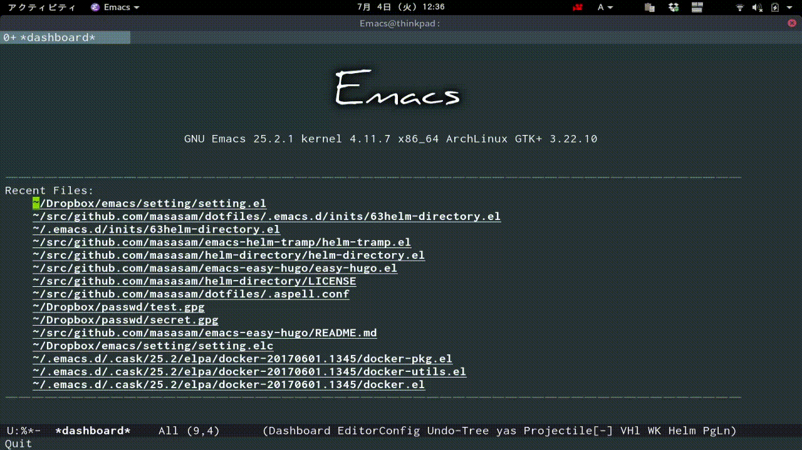

# helm-directory-find-file

Select directory with helm and select the file in this directory with helm interface.

## Screencast

Since the directory has important meanings at the framework,

I want to complement with helm only the files that is in the meaningful directory.

This package provide it.

	M-x helm-directory-find-file

When you select a directory with helm, the file in that directory can be used with helm.

	M-x helm-directory-find-file-change

Chenge helm-directory-find-file-basedir with helm interface.

## Requirements

- Emacs 24.3 or higher
- helm 2.0 or higher
- find, ls command

## Sample Configuration

	(define-key global-map (kbd "C-c l") 'helm-directory-find-file)
	(define-key global-map (kbd "C-c C-l") 'helm-directory-find-file)
	(setq helm-directory-find-file-basedir "/home/masa/src/github.com/project/")
	(setq helm-directory-find-file-basedir-list '("~/src/gitlab.com/project/" "~/Dropbox" "~/Documents"))

helm-directory-find-file-basedir "Complemented under this directory by default".

helm-directory-find-file-basedir-list "Switch based helm-directory-find-file-basedir on this list with M-x helm-directory-find-file-change"

[melpa-link]: http://melpa.org/#/helm-directory-find-file
[melpa-badge]: http://melpa.org/packages/helm-directory-find-file-badge.svg
[melpa-stable-link]: http://stable.melpa.org/#/helm-directory-find-file
[melpa-stable-badge]: http://stable.melpa.org/packages/helm-directory-find-file-badge.svg
