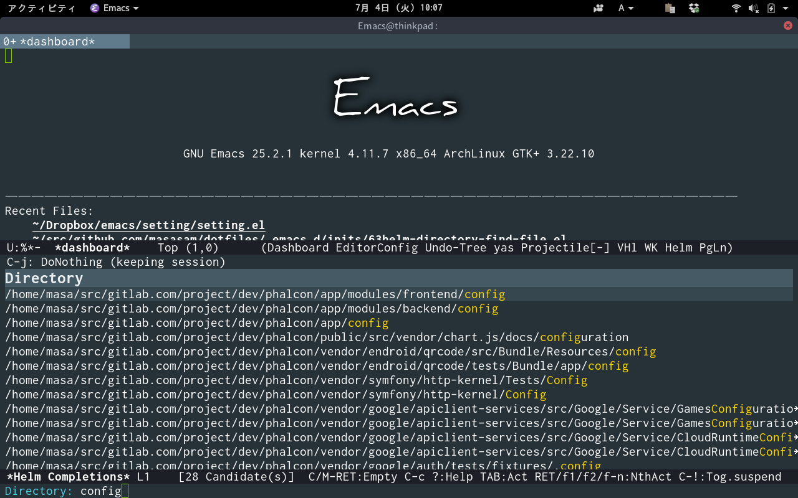
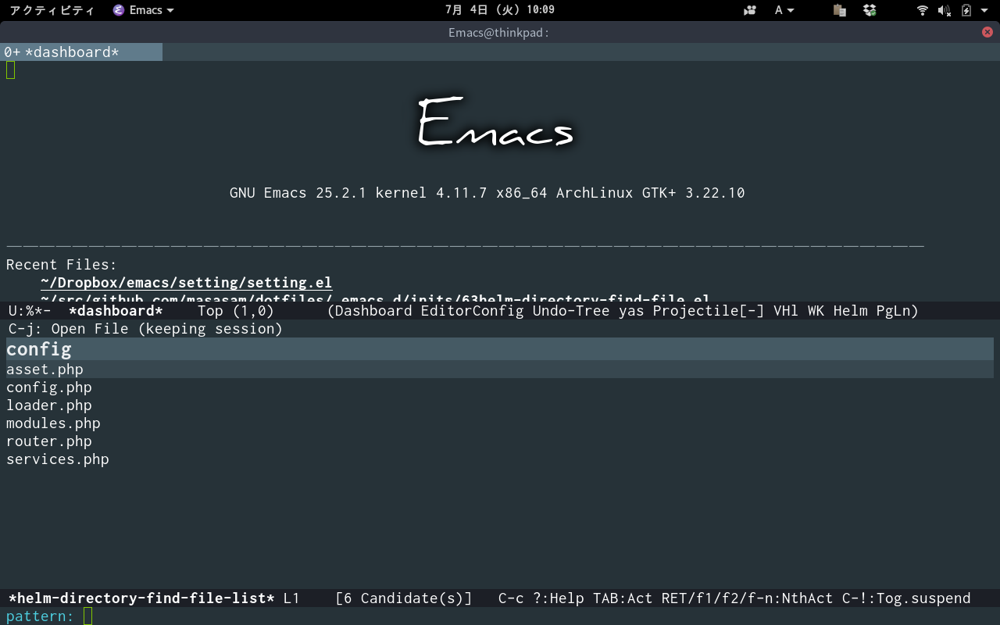
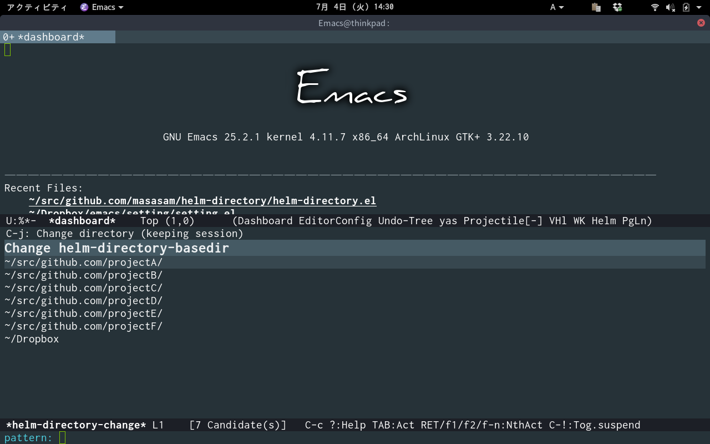

# helm-directory

Helm-directory packages have been unsupported from MELPA.

See https://github.com/melpa/melpa/pull/9509 .

So please use the alternative features in helm.

Select directory with helm and select the file in this directory with helm interface.

## Screencast

Since the directory has important meanings at the framework,

I want to complement with helm only the files that is in the meaningful directory.

This package provide it.

	M-x helm-directory

When you select a directory with helm,

 the file in that directory can be used with helm.

	M-x helm-directory-change

Select helm-directory-basedir from helm-directory-basedir-list with helm interface.

Helm-directory searches directories of helm-directory-basedir.

Since it is too late when there are too many directories, so we will deal with it by switching the search target.

## Requirements

- Emacs 24.3 or higher
- helm 2.0 or higher
- find, ls command

## Installation

You can install `helm-directory.el` from [MELPA](http://melpa.org) with package.el
(`M-x package-install helm-directory`).

## Sample Configuration

	(define-key global-map (kbd "C-c l") 'helm-directory)
	(define-key global-map (kbd "C-c C-l") 'helm-directory)
	(setq helm-directory-basedir "~/src/github.com/projectA/")
	(setq helm-directory-basedir-list '("~/src/github.com/projectA/" "~/src/github.com/projectB/" "~/Dropbox"))

helm-directory-basedir "Complemented under this directory by default".

helm-directory-basedir-list "Switch based helm-directory-basedir on this list with M-x helm-directory-change"

[melpa-link]: http://melpa.org/#/helm-directory
[melpa-badge]: http://melpa.org/packages/helm-directory-badge.svg
[melpa-stable-link]: http://stable.melpa.org/#/helm-directory
[melpa-stable-badge]: http://stable.melpa.org/packages/helm-directory-badge.svg
